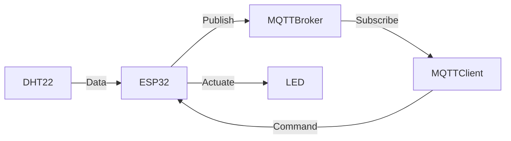

# IoT-Based Temperature and Humidity Monitoring System

This project is an implementation of an IoT-based monitoring system for temperature and humidity using **ESP32**, **MQTT**, and **Wokwi Simulator**. It was developed as part of the **Samsung Innovation Campus Bootcamp Batch 6**.

## Table of Contents
- [Introduction](#introduction)
- [Features](#features)
- [Requirements](#requirements)
- [System Architecture](#system-architecture)
- [Setup Instructions](#setup-instructions)
- [Usage](#usage)
- [Acknowledgments](#acknowledgments)

## Introduction
This project demonstrates how to collect data from a DHT22 sensor and control an LED via MQTT communication. The ESP32 acts as the main microcontroller, while the MQTT protocol enables seamless data exchange with a broker. The entire project was tested and simulated using **Wokwi**, an online hardware simulator.

## Features
- Real-time monitoring of temperature and humidity.
- Control an LED remotely through MQTT.
- MQTT communication with a broker (e.g., `broker.emqx.io`).
- Simulated hardware environment using Wokwi.

## Requirements
To replicate this project, you will need:
- [Wokwi Simulator](https://wokwi.com/)
- ESP32 microcontroller (or simulation via Wokwi)
- DHT22 sensor (simulated)
- LED and resistor (simulated)
- MQTT client (e.g., [MQTTX](https://mqttx.app/))
- Python 3.9+ (optional for local MQTT testing)

## System Architecture


## Setup Instructions

1. **Clone the Repository**
   ```bash
   git clone https://github.com/yourusername/your-repository-name.git
   cd your-repository-name
   ```

2. **Open Wokwi Project**
   - Import the `main.py` script into Wokwi.
   - Configure the ESP32, DHT22, and LED connections in Wokwi according to the provided diagram.

3. **Configure MQTT**
   - Replace the following placeholders in the `main.py` file:
     ```python
     MQTT_BROKER = "broker.emqx.io"
     MQTT_CLIENT_ID = "your_client_id"
     MQTT_TOPIC = "your_topic"
     ```

4. **Run the Simulation**
   - Start the Wokwi simulator.
   - Verify the MQTT messages using an MQTT client (e.g., MQTTX).

## Usage
1. **Start the Wokwi Simulation**
   - The ESP32 will read temperature and humidity data from the DHT22 sensor.
   - Data will be published to the MQTT broker at the specified topic.

2. **Control the LED**
   - Subscribe to the LED topic using an MQTT client.
   - Publish `ON` or `OFF` commands to control the LED remotely.

## Acknowledgments
This project was developed as part of the **Samsung Innovation Campus Bootcamp Batch 6**. Special thanks to the bootcamp mentors and organizers for their guidance and support.

---

Feel free to contribute to this repository by reporting issues or submitting pull requests!

